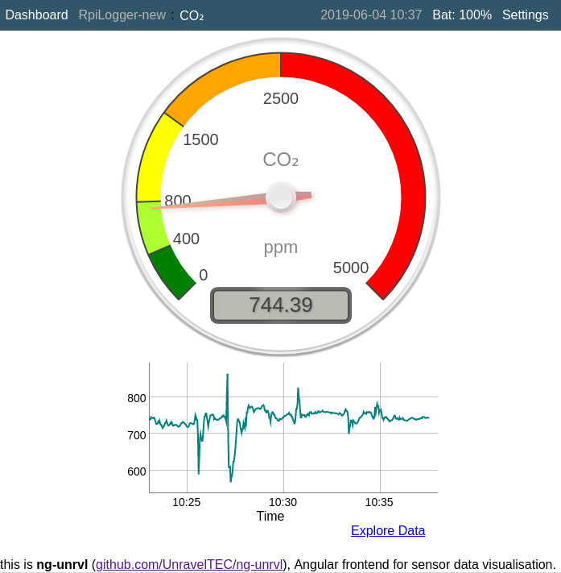

# ng-unrvl

Angular Frontend to visualize data - primarly from Prometheus database as sensor data endpoint.



# Building

```
npm install

npm run build.prod
```

The built project can now be found in `dist/Web`.

# Developing

To application for development:

```
ng serve
```

Access it via http://localhost:4200
